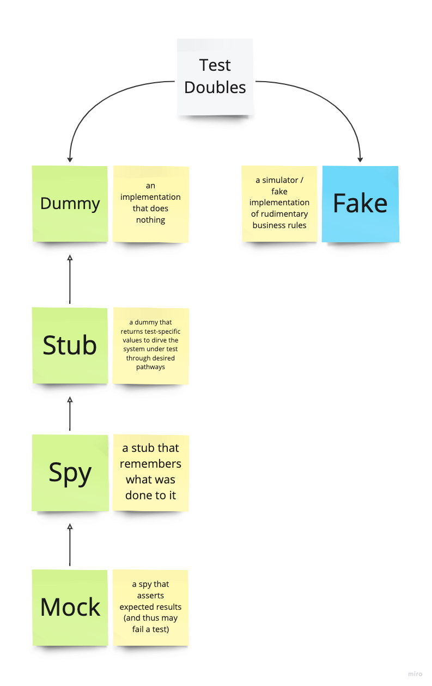
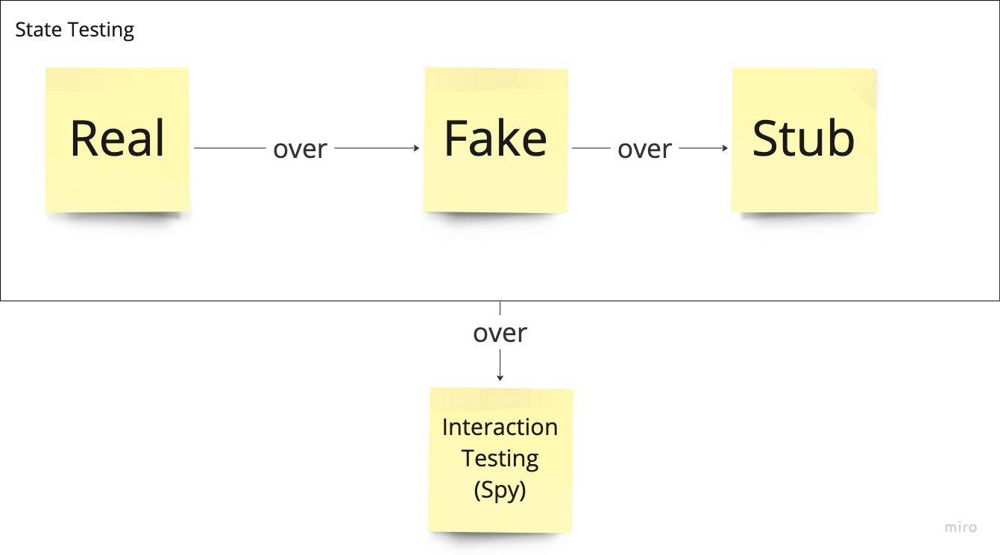

# Test Doubles



## What are Test Doubles?
* An object or function that can stand in for a real implementation in a test.
* Often referred to as mocking (though not all test doubles are mocks).
* Example: in-memory version of a database.
* Allow to write tests that execute quickly and are not flaky compared to the real implementation.

## What are Test Double Trade-Offs?

* **Testability**: a codebase needs to be designed to be _testable_ (e.g. dependency injection).
* **Applicability**: improper use of test doubles (e.g. through mocking frameworks) can lead to brittle and complex
  tests.
* **Fidelity**: test doubles should mimic the real implementation as closely as possible. However, simpler
  implementations mean they cannot give 100% fidelity. Unit tests that use test doubles need to be supplemented by
  larger-scope tests to exercise the real implementation.

# When is Code Testable?

* using a _seam_: allows the use of test doubles, e.g. Dependency injection

## Techniques for Test Doubles

### Fake

* a simplified version of a real implementation that is easier to set up and use. e.g. in-memory database.
* a system under test should not be able to tell whether it's interacting with a fake or the real implementation.

```java
// This fake implements the FileSystem interface. This interface is also
// used by the real implementation.
public class FakeFileSystem implements FileSystem {
  // Stores a map of file name to file contents. The files are stored in
  // memory instead of on disk since tests shouldn’t need to do disk I/O.
  private Map<String, String> files = new HashMap<>();
  @Override
  public void writeFile(String fileName, String contents) {
    // Add the file name and contents to the map.
    files.add(fileName, contents);
  }
  @Override
  public String readFile(String fileName) {
    String contents = files.get(fileName);
    // The real implementation will throw this exception if the
    // file isn’t found, so the fake must throw it too.
    if (contents == null) { throw new FileNotFoundException(fileName); }
    return contents;
  }
}
```

### Stub

* a test double that provides canned responses to calls. e.g. a stub that always returns the same value.

```java
// Pass in a test double that was created by a mocking framework.
AccessManager accessManager = new AccessManager(mockAuthorizationService):

// The user ID shouldn’t have access if null is returned.
when(mockAuthorizationService.lookupUser(USER_ID)).thenReturn(null);
assertThat(accessManager.userHasAccess(USER_ID)).isFalse();

// The user ID should have access if a non-null value is returned.
when(mockAuthorizationService.lookupUser(USER_ID)).thenReturn(USER);
assertThat(accessManager.userHasAccess(USER_ID)).isTrue();
```

* **Interaction Testing**: validate how a function is called without actually calling the implementation of the function

```java
// Pass in a test double that was created by a mocking framework.
AccessManager accessManager = new AccessManager(mockAuthorizationService);
accessManager.userHasAccess(USER_ID);

// The test will fail if accessManager.userHasAccess(USER_ID) didn’t call
// mockAuthorizationService.lookupUser(USER_ID).
verify(mockAuthorizationService).lookupUser(USER_ID);
```

## Real Implementations
* Prefer realism over isolation (not: for each class, an own test class)
* A good test should use as many real objects as possible
* Advantage:  test will fail if there is a bug in a real implementation

### When to use a real implementation?
* when it is fast, deterministic, and has simple dependencies
* _fast_: the more test cases, the higher the impact may be on test execution times when using a real implementation
* _deterministic_: the test should always return the same result for the same input
    * nondeterminism leads to flakiness - if this happens often, use a test double
    * nondeterminism can be caused by e.g. multithreading, system clock, network calls, etc.
    * nondeterminism happens when code is not hermetic: the dependencies on external services are outside the control of
      the test
  
### Dependency construction
* Real implementations possibly require many "new" in their constructors
```java
Foo foo = new Foo(new A(new B(new C()), new D()), new E(), ..., new Z());
```
* Alternative (discouraged if overused)
```java
@Mock Foo mockFoo;
```
* Best practice: use the same factory method to create the object to test as for the production code to create the dependencies
  * Use @Service, @Component etc. for dependency injection in Spring Boot, but beware of public API services vs. internal services
```java
// use test doubles for slow/nondeterministic/complex dependencies (e.g. API)
FooService foo = FooService.create(timeFactory, xyApi)); 

FooService create(TimeFactory timeFactory, XYApi xyApi) {
    // hide away implementation details
    return new FooService(new InternalService1(new SecondInternalService()), new DateService(dateApi), new XYService(xyApi));
}
```

## Faking
* System under test should not be able to tell whether it's interacting with a fake or the real implementation
* Example: interface to access a repository (save, get, update, delete) that is implemented by both real db implementation (e.g. MySQL) and a fake in-memory implementation (e.g. HashMap)
* pro: execute quickly, avoid drawbacks of real implementations (e.g. slow, nondeterministic)
* con: require effort, tests, domain-knowledge, maintenance, can lead to bugs if not kept in sync with the real implementation

### Fidelity
* a fake does not always need to behave exactly like the real implementation
* a fake should conform to the public API contracts (after save(item), get(item.id) should return item, etc.)
* a fake must have perfect fidelity _from the perspective of the test_
  * example: if a test checks if a hash was created, it does not necessarily care about the exact value of the hash, only that it was created
  * If the hash needs to be checked exactly, such a fake cannot be employed!
  * **best practice**: raise an error if an execution path is taken in the real implementation that is not covered by the fake
* a fake is "an optimisation": if the real implementation is too slow/non-deterministic, use a fake

## Stubbing
* a stub is a way for a test to hardcode behavior for a function that otherwise has no behavior on its own

### Dangers of Overusing Stubs
* Tests become unclear: stub code detracts from the intent of the test
  * Sign of overuse: you mentally step through the SUT to understand why certain functions in the test are stubbed
* Tests become brittle: implementation details in the test code
  * Good test: only changes if **user-facing behavior of an API changes**
* Test become less effective
  * A fake needs to conform to the public api. A stub does not.
  * There is no way to test if the stub works like the real implementation
  * Contract is duplicated in each test (e.g. `when(stubCalculator.add(1, 2)).thenReturn(3)`)
  * No state changes testable (like with a fake)
#### Overuse
```java
@Test public void creditCardIsCharged() {
  // Pass in test doubles that were created by a mocking framework.
  paymentProcessor =
      new PaymentProcessor(mockCreditCardServer, mockTransactionProcessor);
  // Set up stubbing for these test doubles.
  when(mockCreditCardServer.isServerAvailable()).thenReturn(true);
  when(mockTransactionProcessor.beginTransaction()).thenReturn(transaction);
  when(mockCreditCardServer.initTransaction(transaction)).thenReturn(true);
  when(mockCreditCardServer.pay(transaction, creditCard, 500))
      .thenReturn(false);
  when(mockTransactionProcessor.endTransaction()).thenReturn(true);
  // Call the system under test.
  paymentProcessor.processPayment(creditCard, Money.dollars(500));
  // There is no way to tell if the pay() method actually carried out the
  // transaction, so the only thing the test can do is verify that the
  // pay() method was called.
  verify(mockCreditCardServer).pay(transaction, creditCard, 500);
}
```
#### Without stubs
* shorter, no implementation details

```java
@Test public void creditCardIsCharged() {
  paymentProcessor = 
      new PaymentProcessor(creditCardServer, transactionProcessor);
  // Call the system under test.
  paymentProcessor.processPayment(creditCard, Money.dollars(500));
  // Query the credit card server state to see if the payment went through.
  assertThat(creditCardServer.getMostRecentCharge(creditCard))
      .isEqualTo(500);
}
```

### When to use a stub?
* for the test of the SUT to handle a variety of return values which may not be possible to trigger from fake/real implementation
* But: a test that requires many functions to be stubbed can be a sign over overuse of stubs / SUT is too complex
* **best practice**: prefer real implementations or fakes over stubs

## Interaction Testing
* prefer state testing over interaction testing
  * either correct value returned, or some state in the SUT was changed
  * interaction testing: only that a function was called, but not what it did 
    * con: e.g. only save() called but not if the item was stored. We only _assume_ it was stored
    * con: exposes implementation details --> brittle tests ("change detector test")
* state testing is more scalable, reduces brittleness, makes test easier to change and maintain over time

### When to use interaction testing?
* unable to test the real implementation (too slow) or fake (doesn't exist, impossible to create)
* difference in the number of calls (e.g. to a database or endpoint) or order of calls
* **better practice**: if state testing is unfeasible, try to create larger-scope tests to see if state can be tested that way 

### Best practice for interaction testing
* Prefer interaction testing only for **state-changing functions**
* Non-state-changing functions return a value, don't modify anything (getUser(), findResults(), readFile())
  * the value is used to continue execution typically
  * The interaction itself is not an important detail for correctness (no side effects)
  * state-changing functions should be asserted to have at least some form of indication that it may have worked
    * it's still better to use state testing if possible

```java
@Test public void grantUserPermission() {
  UserAuthorizer userAuthorizer =
      new UserAuthorizer(mockUserService, mockPermissionDatabase);
  when(mockPermissionService.getPermission(FAKE_USER)).thenReturn(EMPTY);
  
  // Call the system under test.
  userAuthorizer.grantPermission(USER_ACCESS);
  
  // addPermission() is state-changing, so it is reasonable to perform
  // interaction testing to validate that it was called.
  verify(mockPermissionDatabase).addPermission(FAKE_USER, USER_ACCESS);
  
  // getPermission() is non-state-changing, so this line of code isn’t
  // needed. One clue that interaction testing may not be needed:
  // getPermission() was already stubbed earlier in this test.
  verify(mockPermissionDatabase).getPermission(FAKE_USER);
}
```
## Summary

